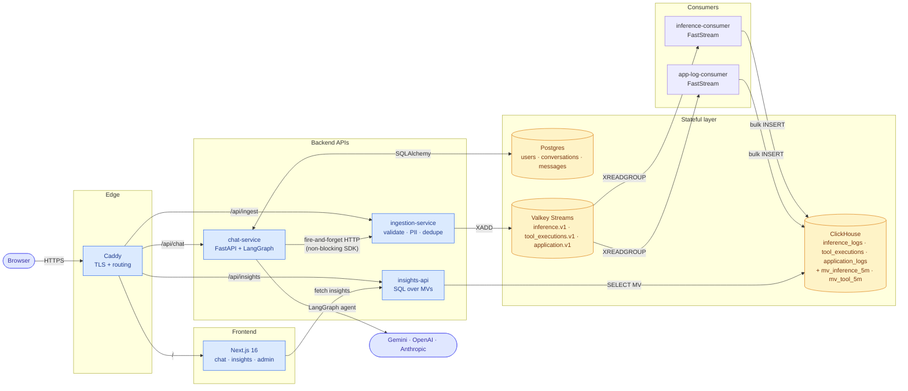

# Ollive — LLM observability platform for AI vendors

Ollive is an end-to-end observability platform for teams shipping LLM-powered products. It ingests inference, tool-execution, and application logs from any service running our lightweight Python SDK, stores them in a workload-appropriate split of Postgres (OLTP) and ClickHouse (OLAP), and exposes the resulting telemetry through a typed Insights API and an in-product operator console. A reference chatbot ships alongside the platform so teams can see realistic traffic flowing through every layer the day they install it.

## Quick start

```bash
make env       # copy .env.example → .env; fill GEMINI_API_KEY + BOOTSTRAP_ADMIN_*
make up        # postgres, valkey (host port 6380), clickhouse
make install   # uv sync the Python workspace
```

Run the Python services in separate terminals (or use `tmux` / `overmind`):

```bash
# Terminal 1 — ingestion
VALKEY_URL='redis://localhost:6380/0' PII_ENABLED=false \
  uv run --package ingestion-service uvicorn ingestion_service.main:app --port 8881

# Terminal 2 — inference + tool_execution consumer
VALKEY_URL='redis://localhost:6380/0' CLICKHOUSE_HOST=localhost \
  uv run --package inference-consumer python -m faststream run inference_consumer.main:app

# Terminal 3 — application-log consumer
VALKEY_URL='redis://localhost:6380/0' CLICKHOUSE_HOST=localhost \
  uv run --package app-log-consumer python -m faststream run app_log_consumer.main:app

# Terminal 4 — insights API
CLICKHOUSE_HOST=localhost \
  uv run --package insights-api uvicorn insights_api.main:app --port 8003

# Terminal 5 — chat service
POSTGRES_HOST=localhost INGESTION_URL=http://localhost:8881/v1/logs \
JWT_SECRET=dev-secret BOOTSTRAP_ADMIN_EMAIL=admin@ollive.demo \
BOOTSTRAP_ADMIN_PASSWORD=admin123 \
  uv run --package chat-service uvicorn chat_service.main:app --port 8000

# Terminal 6 — frontends (npm workspaces — installs both apps + shared types)
npm install
npm run dev:chat       # web-chat on http://localhost:3000
# (in another terminal)
PORT=3002 npm run dev:insights  # web-insights on http://localhost:3002
```

Open `http://localhost:3000` for the end-user chat surface and `http://localhost:3002` for the operator console. The chat admin user is auto-created from `BOOTSTRAP_ADMIN_*` env on chat-service startup; the operator account is auto-created from `CONSOLE_BOOTSTRAP_*` env on insights-api startup.

| Service     | URL                          | Credentials                 |
|-------------|------------------------------|-----------------------------|
| Chat API    | http://localhost:8000        | cookie (after `/auth/login`)|
| Ingestion   | http://localhost:8881        | optional `X-Sdk-Key`        |
| Insights    | http://localhost:8003        | open                        |
| Postgres    | localhost:5432               | `ollive` / `ollivepass`     |
| Valkey      | localhost:6380               | —                           |
| ClickHouse  | http://localhost:8123        | `ollive` / `ollivepass`     |
| Frontend    | http://localhost:3000        | UI auth                     |

## Architecture overview



The ten containers, one line each:

| Container             | Role                                                                       |
|-----------------------|----------------------------------------------------------------------------|
| `postgres`            | OLTP store for users, conversations, messages                              |
| `valkey`              | Event broker (Streams) and idempotency cache                               |
| `clickhouse`          | Append-only analytics warehouse for inference, tool, and application logs  |
| `ingestion-service`   | HTTP intake — validate, PII-redact, dedupe, publish to streams             |
| `inference-consumer`  | FastStream worker draining `inference.v1` + `tool_executions.v1`           |
| `app-log-consumer`    | FastStream worker draining `application.v1`                                |
| `insights-api`        | FastAPI exposing typed query endpoints over the materialized views         |
| `chat-service`        | Reference LangGraph chat backend; auth; ships SDK logs                     |
| `web`                 | Next.js UI with chat, in-app insights, and admin console                   |
| `caddy` (prod only)   | TLS terminator + HTTPS reverse proxy with automatic Let's Encrypt          |

The chat service is one example of an SDK-instrumented application — any vendor service can ship logs through the same path.

## Setup instructions

Prerequisites:

- Docker + Compose v2 (`docker compose version` should print v2.x)
- `uv` for Python workspace management (`pipx install uv`)
- Node 20+ and `npm` (or `pnpm`) for the frontend

Step by step:

1. `make env` — copies `.env.example` to `.env`. Fill in at minimum `GEMINI_API_KEY`, `JWT_SECRET` (32-byte hex), and `BOOTSTRAP_ADMIN_EMAIL` / `BOOTSTRAP_ADMIN_PASSWORD`.
2. `make up` — starts the four infra containers and waits on healthchecks.
3. `make install` — `uv sync` installs the Python workspace into `.venv` and links every app/package.
4. Start the five Python services and the Next.js dev server using the commands in the Quick start. `chat-service` auto-creates the admin from env on first boot (idempotent — safe to re-run with the same email).
5. Hit `http://localhost:3000`, sign in as admin, send a chat message. You should immediately see rows in ClickHouse (`SELECT * FROM ollive.inference_logs ORDER BY started_at DESC LIMIT 5`) and the in-app `/insights` page light up.

When things look broken, in order of usefulness:

- `make logs` — Compose logs for the infra layer (postgres / valkey / clickhouse)
- `make ps` — confirm all three are `healthy`
- `make psql` / `make ch` / `make valkey-cli` — drop into each datastore
- Chat-service logs — auth failures, agent errors, SDK transport warnings
- Ingestion logs — PII model load time on first request, schema validation failures, broker connectivity
- ClickHouse `system.errors` — insert-side failures the consumer DLQs

## What each component is and why we picked it

**LangGraph** — `create_react_agent` for the model-plus-tools loop. Gives us streaming events, a clean tool-calling contract, and a callback surface we hook the SDK into. We considered hand-rolling the loop and rejected it: maintaining a correct ReAct + cancel + streaming implementation is more work than the dependency saves. We don't use LangGraph's checkpointer — Postgres `messages` is our source of truth.

**LangChain chat models** (`langchain-openai`, `langchain-anthropic`, `langchain-google-genai`) — one provider-agnostic `BaseChatModel` interface, official provider SDKs underneath. We explicitly avoided LiteLLM after its March 2026 PyPI supply-chain compromise and the April 2026 CVE-9.3 SQL injection in its proxy. The per-provider LangChain packages give us a smaller dependency surface and a cleaner security history.

**Valkey** — Streams broker and idempotency cache. We picked Valkey over Redis because Redis went SSPL in 2024; Valkey is the Linux Foundation BSD-3 fork and remains API-compatible. Same client library, same protocol, zero functional difference. We picked it over Kafka because a single Valkey container fits Docker Compose and FastStream lets us swap brokers with a config change once throughput demands it.

**ClickHouse** — OLAP store for high-volume append-only telemetry. Columnar storage, materialized views, `quantileState` aggregates that make p95/p99 queries sub-10ms. Langfuse migrated off Postgres to ClickHouse for the same workload; we took the result of their experiment as given.

**Postgres** — OLTP store for chat state. Transactional, indexed, joins. The only place user-owned data (full message bodies) lives.

**fastapi-users** — drop-in JWT cookie auth with register/login/logout/reset wired in. Avoids re-implementing the password storage + session boundary; the surface is small enough to read end-to-end. We chose it over Auth.js + a custom Python verifier because keeping auth inside FastAPI keeps the dependency graph linear.

**Caddy** — production reverse proxy with automatic Let's Encrypt. One Caddyfile fronts the entire stack. We picked it over Nginx + certbot because the certificate lifecycle is free and the config is one-third the lines.

**Microsoft Presidio** — PII analyzer + anonymizer with pluggable recognizers (EMAIL, PHONE, SSN, CC, IP, PERSON, LOCATION, IBAN). Runs centrally inside the ingestion service so policy can be upgraded without redeploying clients.

**Next.js 16 + Vercel AI SDK** — the chat UI uses `useChat` for streaming + cancel. Standard pattern, minimal glue. Next.js middleware enforces the auth cookie at the edge before any page renders.

**Recharts** — chart library powering the in-app `/insights` page. Five charts (latency p50/p95/p99, throughput, cost per model, top conversations, session timelines) hit the Insights API directly. The materialized views keep responses at ~10ms regardless of underlying volume. We considered Grafana for this surface but it duplicated the same ClickHouse reads under a separate auth surface — for a single-tenant product the in-app charts win; if/when ops rotations exist, Grafana can read the same MVs.

**Recharts** — the in-app charts on `/admin/insights`. We picked it over the heavier Plotly/Visx options because Recharts ships small bundles and composes well with React server components.

## Schema design decisions

### Two databases, one product

The chat experience needs transactional reads/writes for conversation lists, message ordering, and user accounts. That's Postgres. The inference and tool-execution telemetry is append-only at high volume with analytical access patterns (p50/p95/p99, group-by-model, time bucketing). That's ClickHouse.

Putting both into Postgres would either compromise the OLTP path (Postgres at 50M+ rows of analytics) or the OLAP path (Postgres struggles with `quantile()` over millions of rows). Splitting by access pattern matches each engine to what it's good at.

### Postgres (OLTP)

- `users (id UUID, email, hashed_password, role CHECK IN ('user','admin'), is_active, is_superuser, is_verified, created_at)`
- `conversations (id, user_id, title, status CHECK IN ('active','cancelled','completed'), model, message_count, created_at, updated_at)` with an index on `(user_id, updated_at DESC)` for the sidebar list
- `messages (id, conversation_id, role CHECK IN ('user','assistant','system','tool'), content, content_redacted, inference_request_id, status, created_at)`

`messages.inference_request_id` is the cross-database link: it points to `inference_logs.request_id` in ClickHouse for that assistant turn. Not a foreign key — two different engines — but the application enforces the invariant.

### ClickHouse (OLAP)

Three append-only tables (`inference_logs`, `tool_executions`, `application_logs`), all `ReplacingMergeTree` engines partitioned by month with 30- to 90-day TTLs. JSON-shaped columns (`metadata`, `tool_calls_summary`, `attributes`) are stored as `String` for portability and queried with ClickHouse's JSON functions when needed.

Two materialized views pre-aggregate the 5-minute buckets so dashboards stay snappy at any volume:

- `mv_inference_5m` — `quantileState(latency_ms)`, `countState()`, `sumState(tokens)`, `sumState(cost_usd)`, `countStateIf(status='error')` grouped by `(bucket, provider, model)`. Dashboards `quantileMerge` / `countMerge` on read.
- `mv_tool_5m` — same shape over `tool_executions` grouped by `(bucket, tool_name)`.

### Idempotency at write time

Each event carries a UUIDv7 `request_id`. Ingestion dedupes within a 10-minute window via Valkey `SET NX`. ClickHouse `ReplacingMergeTree` collapses any duplicate that slips through, keyed by `(started_at, provider, model, request_id)`, keeping the row with the largest `received_at`. A given `request_id` lands in ClickHouse exactly once even under retry storms.

### Inference log envelope (the wire contract)

```json
{
  "schema_version": "1.0",
  "log_type": "inference",
  "request_id": "uuid",
  "conversation_id": "uuid",
  "session_id": "uuid",
  "user_id": "uuid|null",
  "service": "chat-service",
  "provider": "google|openai|anthropic",
  "model": "gemini-2.5-pro",
  "started_at": "ISO-8601",
  "finished_at": "ISO-8601",
  "latency_ms": 1234,
  "ttft_ms": 250,
  "stream": true,
  "prompt_tokens": 142,
  "completion_tokens": 318,
  "total_tokens": 460,
  "cost_usd": 0.00234,
  "status": "ok | error | cancelled | timeout",
  "finish_reason": "stop | tool_calls | length | content_filter | error",
  "tool_calls_count": 1,
  "tool_calls_summary": [{"name": "get_current_time", "args_preview": "{...}"}],
  "error_code": null,
  "error_message": null,
  "input_preview": "first 500 chars (PII-redacted)",
  "output_preview": "first 500 chars (PII-redacted)",
  "metadata": {"temperature": 0.7, "max_tokens": 1024}
}
```

## Tradeoffs

| Decision | Trade-off |
|---|---|
| **LangGraph over hand-rolled orchestration** | Buys the ReAct tool loop, streaming, and a callback surface for free, at the cost of a heavier dependency tree. We don't use its checkpointer — Postgres `messages` is the source of truth. |
| **LangChain chat models, not LiteLLM** | LiteLLM was the obvious popular choice but had a March 2026 PyPI supply-chain attack and an April 2026 CVE-9.3 SQL injection. We took the safer path of per-provider LangChain packages that wrap official provider SDKs. |
| **Valkey, not Redis** | Redis went SSPL in 2024; Valkey is the Linux Foundation OSS fork (BSD-3). API-compatible, same client library, no functional change. |
| **Lightweight Valkey Streams, no Kafka** | A single Valkey container fits Docker Compose. FastStream abstracts the broker so swapping to Kafka or NATS is a config change. Below ~50k events/s, Valkey Streams handles it. |
| **Materialized views, not query-time aggregation** | Dashboards stay snappy at any volume but you pay a small write amplification on every insert. Worth it. |
| **Cookie-based JWT, not OAuth providers** | Simpler to operate. `fastapi-users` ships the JWT + cookie surface; bolting Google/GitHub OAuth on is a few additional lines when we need it. |
| **No checkpointer for LangGraph** | The agent is stateless per request; Postgres `messages` is the persistence layer. Adding `PostgresSaver` would buy graph-level time-travel at the cost of two sources of truth. |
| **PII redaction in ingestion, not the SDK** | Centralized policy upgradable without redeploying clients. Original message bodies live in Postgres `messages.content` (user data, they own it); only the previews shipped to ClickHouse are redacted. |
| **Two separate consumer services** | Could be one process. Worth the small extra config for operational clarity (independent scaling, independent failure domains). |
| **Stateless LangGraph instead of `PostgresCheckpointer`** | The agent is reconstructed per request from `messages`; cheaper, simpler, and the checkpointer's branching features aren't on our roadmap yet. |
| **Direct path-based routing in Caddy, not subdomains** | One certificate, one domain, simpler DNS. `/api/*` and the Next.js root all live under one host. |
| **Docker Compose on a VM as the recommended ops path** | Kubernetes manifests (Kustomize) ship in the repo and build cleanly, but Compose + Caddy on a single VM is the realistic single-node deployment. We promote it ahead of k8s. |

## What we'd improve next

1. **Move model selection server-side / admin-controlled.** Today the chat page has a model dropdown any user can change. In production end-users shouldn't be picking arbitrary providers — that's a cost / capacity / policy decision. The dropdown should move to an `/admin/models` config (or be hidden entirely with the server routing requests to the right provider based on tenant policy).
2. **LangGraph PostgresCheckpointer** — adopt a checkpointer to enable graph-level time-travel and branching from the insights timeline view.
3. **Real Alembic migrations** — replace `Base.metadata.create_all()` with proper migrations before any production workload that requires zero-downtime schema changes.
4. **OAuth (Google/GitHub) login** — `fastapi-users` supports OAuth providers as a small addition on top of the current email/password flow.
5. **PII redaction warm-up** — Presidio's spaCy model takes ~3s on first request; move it to a startup hook so the first user request doesn't pay the cost.
6. **Cost calculation per (provider, model)** — currently we record cost only when the provider returns usage. A static price table per model would give us cost on every event.
7. **Streaming-cancel integration test** — one cancel test is currently skipped because the SQLAlchemy session is bound to the pytest greenlet and the production cancel path (via `StreamingResponse`) is structurally different. A proper httpx + ASGI test would cover it.
8. **Anomaly detector with seasonality awareness** — today the anomaly detector uses z-score over a rolling 1h window. Traffic that varies by time-of-day deserves a seasonality model.
9. **Multi-tenant compartments** — `users.role` is binary. Production needs org/team scoping.
10. **OpenTelemetry trace propagation** — we already carry `request_id` end-to-end, which gets most of the value. Real OTLP would tie us into existing customer observability stacks.

## Repo layout

```
apps/
  chat-service/           FastAPI: /chat (SSE), /conversations, /auth, /admin
  ingestion-service/      FastAPI: /v1/logs (validate + PII + publish)
  inference-consumer/     FastStream: inference.v1 + tool_executions.v1 → ClickHouse
  app-log-consumer/       FastStream: application.v1 → ClickHouse
  insights-api/           FastAPI: /insights/*
  web/                    Next.js 16 + Vercel AI SDK + Recharts
packages/
  chatbot-sdk/            Python SDK (InferenceLogger, @tool_traced, transport)
infra/
  docker-compose.yml             dev-only infra (3 containers)
  docker-compose.prod.yml        full stack + Caddy for single-VM deploys
  caddy/Caddyfile
  clickhouse/init.sql
  k8s/{base,overlays/{local,prod}}     Kustomize manifests
docs/
  PLAN.md                 the design document — what we built and why
  INDEX.md                docs entry point
ARCHITECTURE.md           the deep-dive companion to this README
```

## Testing

```bash
make test   # 65 passed, 1 skipped
```

Coverage spans:

- SDK transport — drop policy, retries, batching, close semantics
- SDK span lifecycle — ok / error / cancelled / tool-calls
- Ingestion — schema validation, PII service, end-to-end orchestration
- Consumers — batch service, ClickHouse writer, DLQ on insert failure
- Chat service — repositories, agent invocation, conversation cancel state transitions
- Insights — service layer, window parsing, anomaly detection

The one skipped test exercises mid-stream cancel through `StreamingResponse`. The SQLAlchemy session is bound to the pytest task's greenlet, and the production cancel path runs inside a FastAPI streaming response generator that has a structurally different task boundary. A proper httpx + ASGI integration test will replace it.

End-to-end pipeline verified locally: SDK → ingestion → Valkey Streams → consumer → ClickHouse → insights API. Rows reach `/insights/summary` within seconds of the LLM call returning.

## Deployment

The recommended single-node path is **Docker Compose on a VM, fronted by Caddy with automatic Let's Encrypt**. The full stack — eleven containers — is described by `infra/docker-compose.prod.yml`. A typical deployment:

1. Provision a small ARM or x86 VM (any cloud; we've run on Oracle Cloud Always Free A1.Flex and Hetzner CAX31).
2. Install Docker + Compose plugin.
3. `git clone`, `cp .env.example .env`, fill secrets, set `DOMAIN=your.host`.
4. `docker compose -f infra/docker-compose.prod.yml up -d`.
5. Caddy obtains a certificate on first request. `https://${DOMAIN}` serves the Next.js app; `/api/chat`, `/api/insights`, and `/api/ingest` are reverse-proxied to the corresponding services.

Kubernetes manifests live under `infra/k8s/` (Kustomize: `base/` + `overlays/{local,prod}/`) and `kubectl kustomize` builds cleanly. They are committed for users who already run k3s/k8s, but Compose on a single VM is the recommended ops path for most installations.

## License

All dependencies are OSI-approved open source. The only proprietary component in the stack is the LLM API key. The platform itself ships under a standard OSS license — see the repo for the authoritative `LICENSE` file when present.
